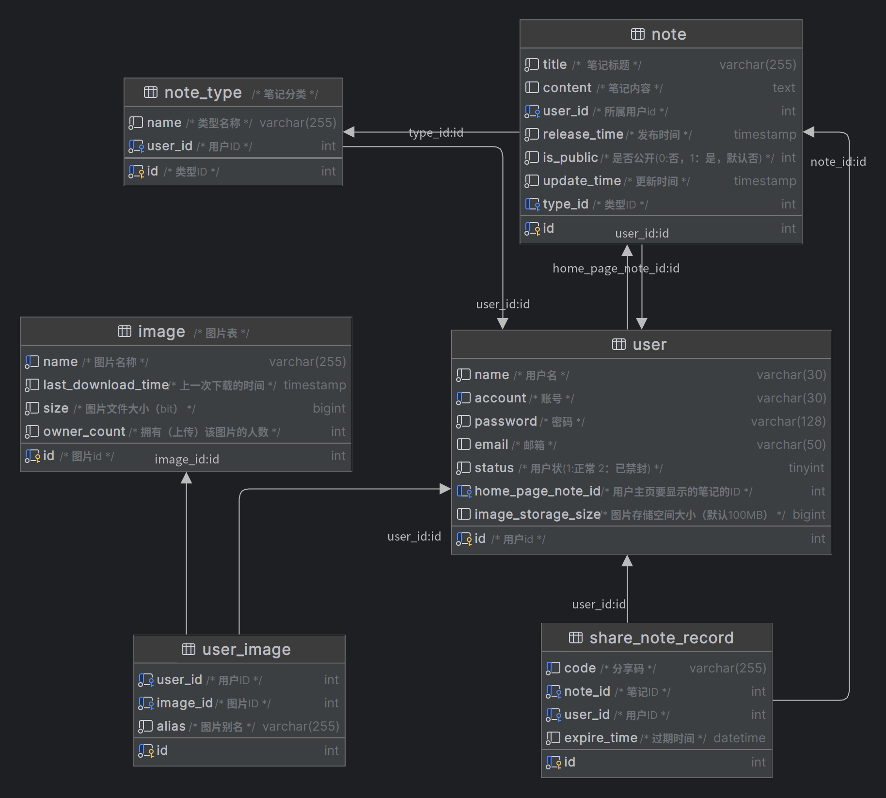

# XNote

[简体中文](readme.md) | English |  [api-doc](./docs/api-doc.md)

## Introduction

XNote is an open-source web-based Markdown note management application that supports online editing and previewing of Markdown notes.

---

## Deploying with Docker

### Frontend

```shell
docker run -d -it \
  -p 3000:3000 \
  --name xnote-nuxt \
  ghcr.io/xclhove/xnote-nuxt
```

* `API_SERVER_URL`: The backend API address, such as “http://localhost:8080”.
* `IPC`: The record number, such as: “蜀IPC备-xxxxxxx号”.

### Backend

```shell
docker run -d -it \
  -p 8080:8080 \
  --name xnote-springboot \
  -v xnote-config:/app/config \
  ghcr.io/xclhove/xnote-springboot
```

---

## Technology Stack

1. [Vue3](https://github.com/vuejs/)
2. [Nuxt3](https://nuxt.com/)
3. [TypeScript](https://www.typescriptlang.org/)
4. [Vditor](https://github.com/Vanessa219/vditor)
5. [Spring Boot](https://spring.io/guides/gs/spring-boot)
6. [MyBatis-Plus](https://baomidou.com)
7. [MySQL](https://www.mysql.com/)
8. [MinIO](https://min.io/)
9. [Elasticsearch](https://www.elastic.co/cn/elasticsearch/)

---

## Database Design



---

## Git Repositories

- Frontend: [xnote-nuxt(github)](https://github.com/XCLHove/xnote-nuxt) | [xnote-nuxt(gitee)](https://gitee.com/xclhove/xnote-nuxt)

- Backend: [xnote-springboot(github)](https://github.com/XCLHove/xnote-springboot) | [xnote-springboot(gitee)](https://gitee.com/xclhove/xnote-springboot)

---

## Backend Build

Java 8 and Maven are required.

1. Navigate to the project root directory and install dependencies:
    ```sh
    mvn clean install
    ```
2. Build
    ```sh
    mvn package
    ```
3. The build artifacts are located in the `.output` directory and can be directly deployed to the server:
   ```sh
   java -jar target/xnote-springboot-v<version>.jar
   ```

---

## Frontend Build

Node.js and Yarn are required.

1. Navigate to the project root directory and install dependencies:
    ```sh
    yarn install
    ```
2. Build
    ```sh
    yarn build
    ```
3. The build artifacts are located in the `.output` directory and can be directly deployed to the server. Start the server with `.output/server/index.mjs`:
   ```sh
   node ./output/server/index.mjs
   ```

## Environment Variables(Frontend)
* API_SERVER_URL (required): Backend API address, e.g., "http://localhost:8080".
* IPC (optional): Record number, e.g., "蜀IPC备-xxxxxxx号".